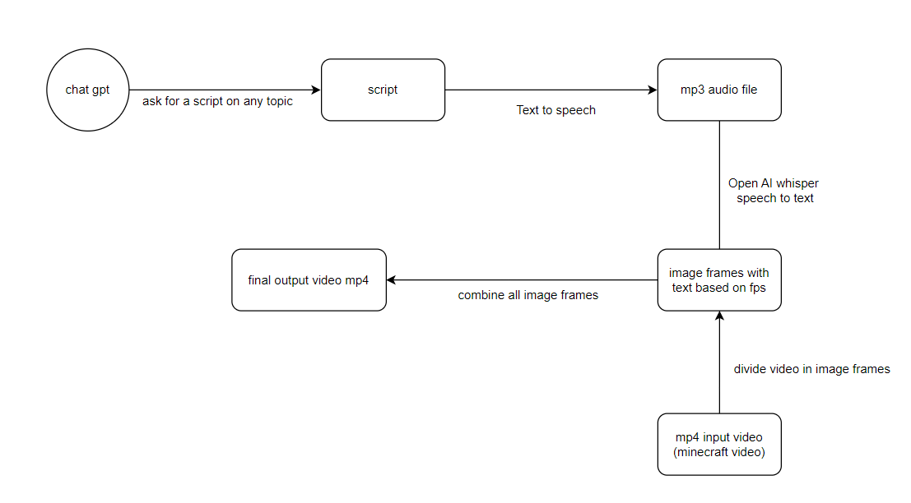

### viral tiktok/reel/shorts generator using python

#### demo 

in demo.mp4 file

#### flow of code explained below


#### Instructions to run
1. clone the repo
2. ```pip install whisper cv2 tqdm moviepy```
3. make sure you have ffmpeg on your machine 
4. run python index.py


#### things to improve and future scope
<kbd>→</kbd> improve the function where text is added on image frame, better ui looks and feel, spacing
<br>
<kbd>→</kbd> take care of edge case where length of video is less than script. In that case the video could be repeated
<br>
<kbd>→</kbd> future scope - have an end to end SaaS product with web/app interface with multiple viral templete videos to select from, inbuilt chat interface to generate ideas and subsequent script using Open AI's api. 
